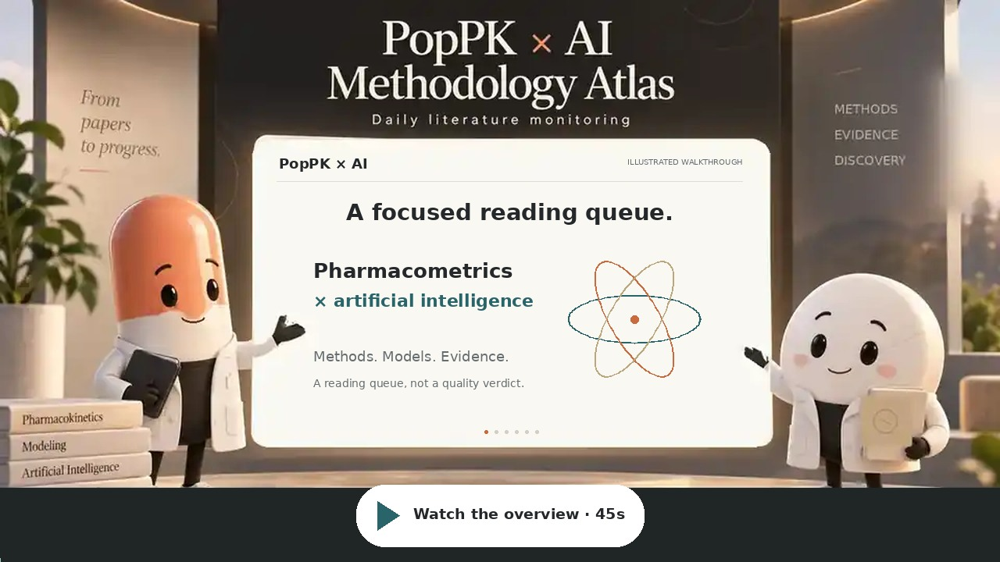

# PopPK × AI Literature Monitor

This repository is a vibe-coded proof of concept for automated literature monitoring.

## Watch the overview

**[Play the video](https://nakamarusan.github.io/poppk-ai-literature-monitor/explainer.html)** · [MP4](https://nakamarusan.github.io/poppk-ai-literature-monitor/media/atlas-explainer.mp4) · [English transcript](docs/media/transcript.md)

A 44-second illustrated walkthrough with English captions. The left capsule speaks in a low, measured male voice; the right tablet answers in a bright female voice. Both are stock synthetic voices, not imitations of real people. Click the thumbnail to open the video player. [Production and source notes](docs/media/README.md).

## What it does

Every day at 07:00 JST, GitHub Actions searches Europe PMC, Crossref, and optionally arXiv for methodology papers connecting population pharmacokinetics, pharmacometrics, and AI or machine learning. If no new eligible paper is found, the monitor selects one previously unreported, abstract-bearing paper published in 2020 or later.

Titles and abstracts are used for primary screening and relevance scoring. Interpretations use the available abstract only; the program does not fetch or analyze full text.

For each selected paper, the workflow creates a GitHub Issue, writes a report in `reports/`, updates `data/articles.json`, and rebuilds `docs/articles.json`.

After every successful monitor run on `main`, a separate `workflow_run` deployment checks out the latest `main` and publishes `docs/`. This also publishes changes made with `GITHUB_TOKEN`.

Transient HTTP 429 and 5xx responses use bounded backoff and `Retry-After` handling. Later successful retries replace stale warnings while preserving same-day paper selections.

Dashboard: https://nakamarusan.github.io/poppk-ai-literature-monitor/

Program and selection methods: https://nakamarusan.github.io/poppk-ai-literature-monitor/method.html

The interface uses system typography, readable spacing, light/dark support, and optional geometric motion. All graphics are original; no third-party product imagery or brand assets are embedded.

The 0–100 primary relevance score measures scope alignment, not scientific quality, validity, novelty, or clinical usefulness.
